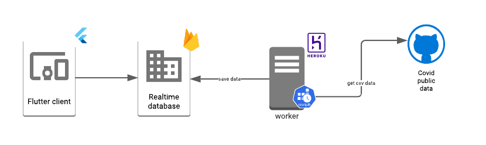
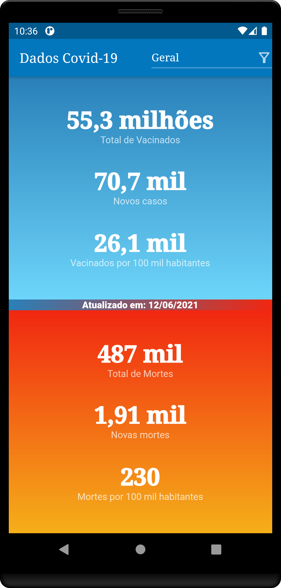
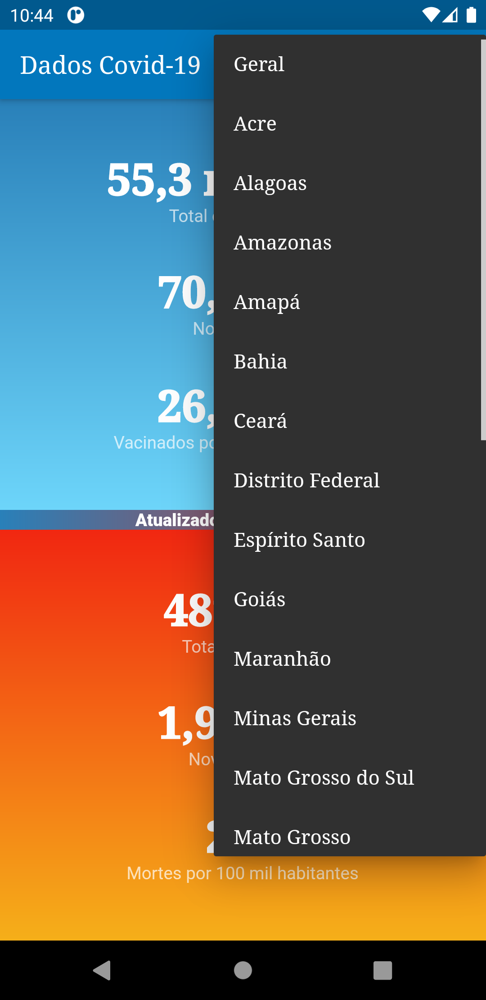

# CovidBR
Aplicativo que fornece dados da pandêmia de Covid-19 no Brasil

- Mobile App desenvolvido em Flutter
- Server desenvolvido em python

### 
Os dados são obtidos a partir do repositório [covid19br](https://github.com/wcota/covid19br) e salvos no [Firestore database](https://firebase.google.com/docs/firestore).



- [Server](server/README.md)
    - HEROKU deploy:  ```git push heroku `git subtree split --prefix server `:master --force```

- [Mobile](client)

### Telas

- Dados gerais

- Dados por estado



### 
obs: Esse aplicativo foi removido da Play Store
```
Pursuant to Section 8.3 of the Developer Distribution Agreement and the Enforcement policy, apps referencing COVID-19, or related terms in the app title, developer name, or app icon of the Google Play Store listing metadata will only be approved for distribution on Google Play if they are published, commissioned, or authorized by official government entities or organizations deeply rooted in healthcare. Google reserves the discretion to remove apps from Google Play based on a number of factors including a high risk of abuse.
```

